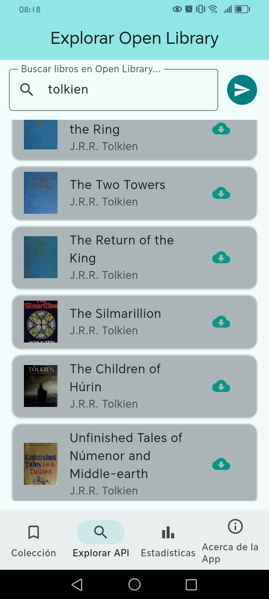
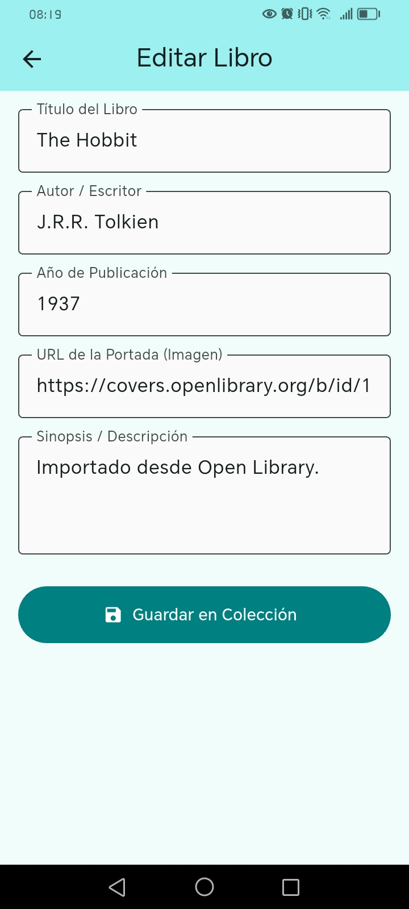
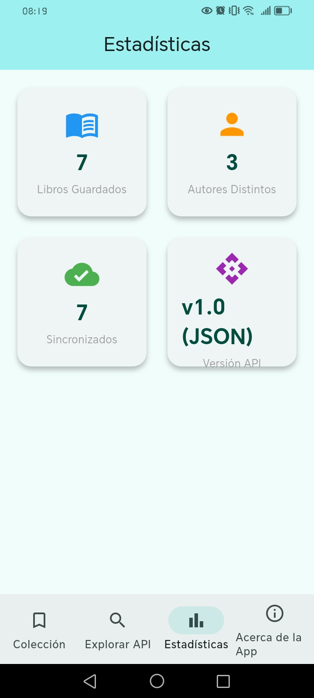

# Gestor de Libros (Android App)

Aplicación móvil desarrollada en **Flutter** que permite gestionar una colección personal de libros. La aplicación combina la persistencia de datos en la nube mediante **MongoDB Atlas** y la consulta de metadatos globales en tiempo real a través de la API de **Open Library**.

---

## Integrantes del Equipo
* **Nombre:** Paulo Cisneros

---

## API Utilizada: Open Library
La aplicación consume la **[Open Library REST API](https://openlibrary.org/developers/api)**, un servicio abierto que provee información bibliográfica detallada.

* **Endpoint principal:** `GET /search.json`
* **Funcionalidad:** Implementa una búsqueda paginada con *Infinite Scroll*, permitiendo explorar miles de títulos de manera eficiente y fluida.

---

## Tecnologías Implementadas
* **Frontend:** Flutter (Material Design 3).
* **Base de Datos:** MongoDB Atlas (NoSQL) con conexión mediante el driver `mongo_dart`.
* **Comunicación:** HTTP REST para consumir JSON externo.
* **Características Clave:**
    * **CRUD Completo:** Creación, lectura, edición y eliminación de libros en la base de datos en la nube.
    * **Persistencia:** Almacenamiento permanente en MongoDB Atlas.
    * **Optimización:** *Infinite Scroll* dinámico para evitar la sobrecarga de memoria en el dispositivo.
    * **UI Reactiva:** Actualización automática de estadísticas (KPIs) en tiempo real al navegar entre secciones.

---

## Instrucciones de Ejecución (APK)

Para instalar y probar la aplicación directamente en un dispositivo Android:

1. **Obtención del archivo:**
   Descarga el archivo `app-release.apk` desde la sección de **Releases** de este repositorio.

2. **Configuración de seguridad:**
   * Ve a **Ajustes > Seguridad** en tu dispositivo Android.
   * Activa la opción **"Instalar aplicaciones de fuentes desconocidas"**.

3. **Instalación:**
   * Abre el archivo `.apk` descargado en tu gestor de archivos.
   * Selecciona **Instalar** y sigue los pasos en pantalla.

4. **Ejecución:**
   * Busca el icono **"Gestor de Libros"** en tu pantalla de inicio.
   * Asegúrate de tener conexión a Internet para que la app pueda sincronizarse con tu cluster de MongoDB Atlas.

---

## Estructura del Proyecto
* `lib/db/`: Lógica de conexión y operaciones CRUD con MongoDB.
* `lib/models/`: Definición de la clase `Libro` y adaptadores JSON.
* `lib/pages/`: Vistas de la aplicación (`home_page.dart`, `about_page.dart`, etc.).
* `assets/`: Recursos multimedia y capturas de pantalla de la interfaz.

---

## Capturas de Pantalla

| Vista | Descripción |
| :--- | :--- |
|  | Visualización de la colección local guardada. |
|  | Explorador API con Infinite Scroll. |
|  | Formulario de creación/edición de libros. |
|  | KPIs calculados en tiempo real. |

---
 ## Captura de base de datos en Mongo
 


 
* **Compilación:** Si deseas generar una nueva versión del APK desde el código fuente, utiliza el comando:
  ```bash
  flutter build apk --release
